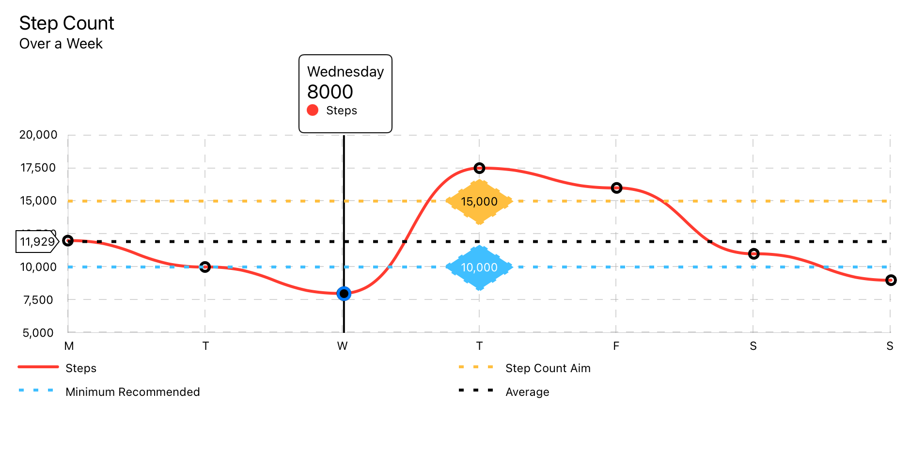
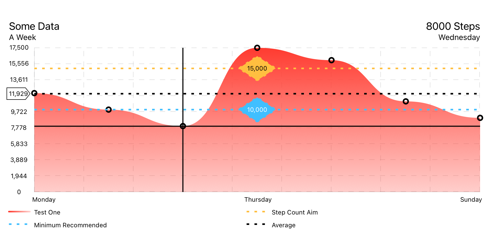
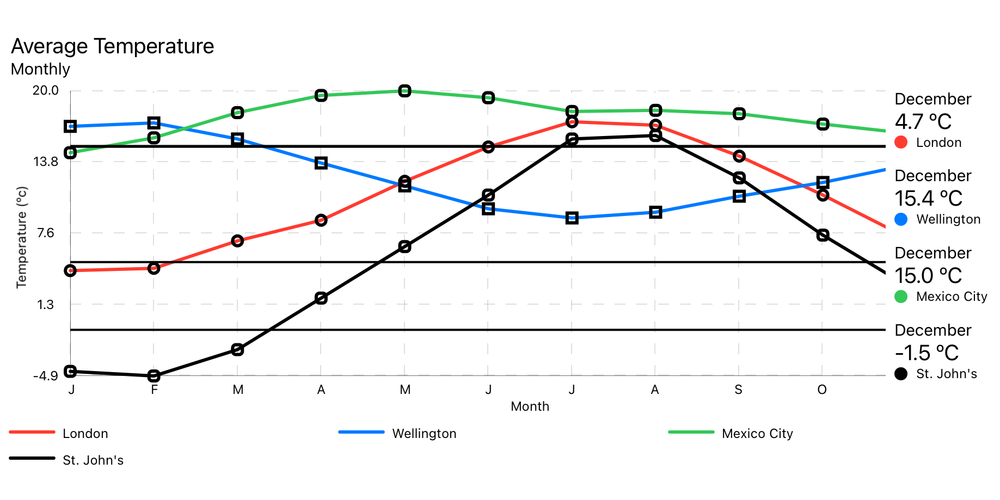
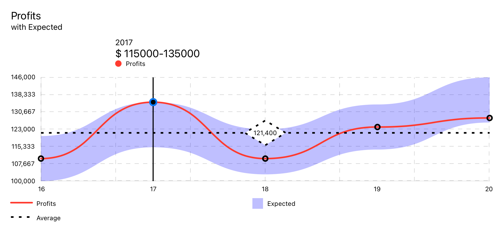
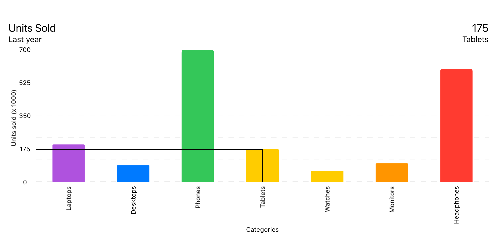
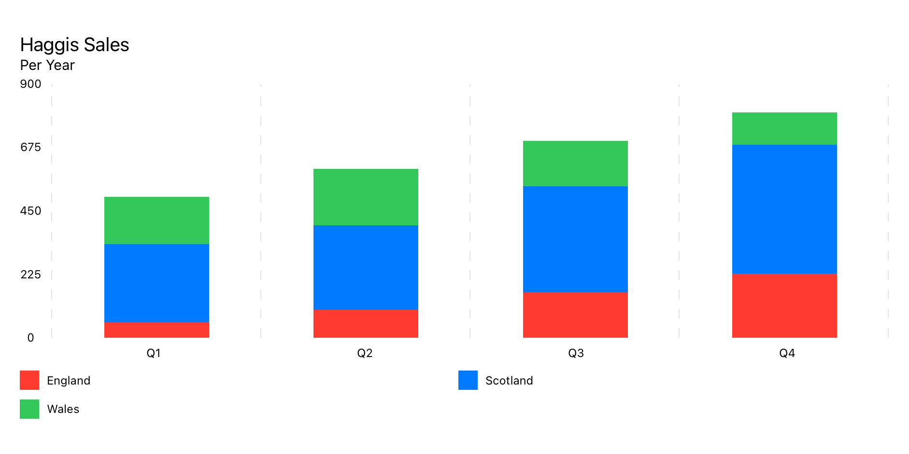
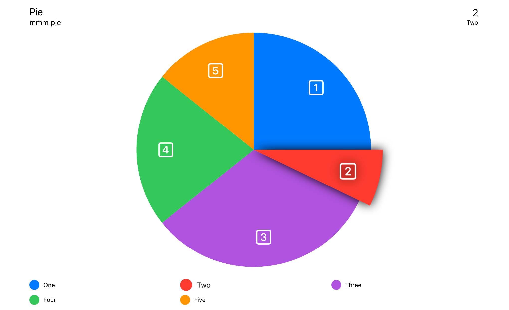

# SwiftUICharts

A charts / plotting library for SwiftUI. Works on macOS, iOS,  watchOS, and tvOS. Has accessibility features built in

[Demo Project](https://github.com/willdale/SwiftUICharts-Demo)

## Examples

### Line Charts

#### Line Chart


#### Filled Line Chart


#### Multi Line Chart


#### Ranged Line Chart



### Bar Charts

#### Bar Chart


#### Range Bar Chart


#### Grouped Bar Chart


#### Stacked Bar Chart



### Pie Charts

#### Pie Chart


#### Doughnut Chart


## Installation

Swift Package Manager

```
File > Swift Packages > Add Package Dependency...
```

## Documentation

[View Modifiers](#View-Modifiers) 
- [Touch Overlay](#Touch-Overlay) 
- [Point Markers](#Point-Markers) 
- [Average Line](#Average-Line) 
- [Y Axis Point Of Interest](#Y-Axis-Point-Of-Interest) 
- [X Axis Grid](#X-Axis-Grid) 
- [Y Axis Grid](#Y-Axis-Grid) 
- [X Axis Labels](#X-Axis-Labels) 
- [Y Axis Labels](#Y-Axis-Labels) 
- [Header Box](#Header-Box) 
- [Legends](#Legends) 

[Data Models](#Data-Models) 
- [Chart Data](#ChartData) 
- [Chart Data Point](#ChartDataPoint) 
- [Chart Metadata](#ChartMetadata)
- [Chart Style](#ChartStyle) 
    - [Grid Style](#GridStyle) 
    - [XAxisLabelSetup](#XAxisLabelSetup) 
    - [YAxisLabelSetup](#YAxisLabelSetup) 
- [Line Style](#LineStyle) 
- [Bar Style](#BarStyle) 
- [Point Style](#PointStyle) 

## View Modifiers

### All Chart Types

#### Touch Overlay

Detects input either from touch of pointer. Finds the nearest data point and displays the relevent information where specified. 

The location of the info box is set in [ChartStyle](#ChartStyle) -> infoBoxPlacement.

```swift
.touchOverlay(chartData: CTChartData, specifier: String, unit: TouchUnit)
```
- chartData: Chart data model.
- specifier: Decimal precision for labels.
- unit: Unit to put before or after the value.

Setup within  [ChartData](#ChartData) --> [ChartStyle](#ChartStyle) 


---


#### Info Box

Displays the information from [Touch Overlay](#TouchOverlay) if `InfoBoxPlacement` is set to `.infoBox`.

The location of the info box is set in [ChartStyle](#ChartStyle) -> infoBoxPlacement.

```swift
.infoBox(chartData: CTChartData)
```
- chartData: Chart data model.


---


#### Floating Info Box

Displays the information from [Touch Overlay](#TouchOverlay) if `InfoBoxPlacement` is set to `.floating`.

The location of the info box is set in [ChartStyle](#ChartStyle) -> infoBoxPlacement.

```swift
.floatingInfoBox(chartData: CTChartData)
```
- chartData: Chart data model.


---


#### Header Box

Displays the metadata about the chart. See [ChartMetadata](#ChartMetadata).

Displays the information from [Touch Overlay](#TouchOverlay) if `InfoBoxPlacement` is set to `.header`.

The location of the info box is set in [ChartStyle](#ChartStyle) -> infoBoxPlacement.

```swift
.headerBox(chartData: data)
```


---


#### Legends

Legends from the data being show on the chart (See [ChartMetadata](#ChartMetadata) ) and any markers (See [Average Line](#Average-Line)  and [Y Axis Point Of Interest](#Y-Axis-Point-Of-Interest)). 

```swift
.legends()
```
Lays out markers over each of the data point.


---


### Line and Bar Charts

#### Average Line

Shows a marker line at the average of all the data points.

```swift
.averageLine(chartData: CTLineBarChartDataProtocol,
             markerName: "Average",
             labelPosition: .yAxis(specifier: "%.0f"),
             lineColour: .primary,
             strokeStyle: StrokeStyle(lineWidth: 3, dash: [5,10]))
```
- chartData: Chart data model.
- markerName: Title of marker, for the legend.
- labelPosition: Option to display the markers’ value inline with the marker.
- labelColour: Colour of the Text.
- labelBackground: Colour of the background.
- lineColour: Line Colour.
- strokeStyle: Style of Stroke.


---


#### Y Axis Point Of Interest

Configurable Point of interest

```swift
.yAxisPOI(chartData: CTLineBarChartDataProtocol,
          markerName: "Marker",
          markerValue: 123,
          labelPosition: .center(specifier: "%.0f"),
          labelColour: Color.black,
          labelBackground: Color.orange,
          lineColour: Color.orange,
          strokeStyle: StrokeStyle(lineWidth: 3, dash: [5,10]))
```
- chartData: Chart data model.
- markerName: Title of marker, for the legend.
- markerValue: Value to mark
- labelPosition: Option to display the markers’ value inline with the marker.
- labelColour: Colour of the Text.
- labelBackground: Colour of the background.
- lineColour: Line Colour.
- strokeStyle: Style of Stroke.
- Returns: A  new view containing the chart with a marker line at a specified value.


---


#### X Axis Grid

Adds vertical lines along the X axis.

```swift
.xAxisGrid(chartData: CTLineBarChartDataProtocol)
```
Setup within  [ChartData](#ChartData) --> [ChartStyle](#ChartStyle).


---


#### Y Axis Grid

Adds horizontal lines along the Y axis.

```swift
.yAxisGrid(chartData: CTLineBarChartDataProtocol)
```
Setup within  [ChartData](#ChartData) --> [ChartStyle](#ChartStyle).


---


#### X Axis Labels

Labels for the X axis.

```swift
.xAxisLabels(chartData: CTLineBarChartDataProtocol)
```
Setup within  [ChartData](#ChartData) --> [ChartStyle](#ChartStyle).


---


#### Y Axis Labels

Automatically generated labels for the Y axis

```swift
.yAxisLabels(chartData: CTLineBarChartDataProtocol, specifier: "%.0f")
```
- specifier: Decimal precision specifier.

Setup within  [ChartData](#ChartData) --> [ChartStyle](#ChartStyle).


---


### Line Charts

#### Point Markers

Lays out markers over each of the data point.

```swift
.pointMarkers(chartData: CTLineChartDataProtocol)
```
Setup within  [ChartData](#DataSet) --> [PointStyle](#PointStyle).


## Data Models

### ChartData

The ChartData type is where the majority of the configuration is done. The only required initialiser is dataPoints.

```swift
ChartData(dataPoints    : [ChartDataPoint],
          metadata      : ChartMetadata,
          xAxisLabels   : [String]?,
          chartStyle    : ChartStyle,
          lineStyle     : LineStyle,
          barStyle      : BarStyle,
          pointStyle    : PointStyle,
          calculations  : CalculationType)
```
- dataPoints: Array of ChartDataPoints. See [ChartDataPoint](#ChartDataPoint).
- metadata: Data to fill in the metadata box above the chart. See [ChartMetadata](#ChartMetadata).
- xAxisLabels: Array of Strings for when there are too many data points to show all xAxisLabels.
- chartStyle : The parameters for the aesthetic of the chart. See [ChartStyle](#ChartStyle).
- lineStyle: The parameters for the aesthetic of the line chart.  See [LineChartStyle](#LineLineChartStyle).
- barStyle: The parameters for the aesthetic of the bar chart. See [BarStyle](#BarStyle).
- pointStyle: The parameters for the aesthetic of the data point markers.  See [PointStyle](#PointStyle).
- calculations: Choose whether to perform calculations on the data points. If so, then by what means.


### ChartDataPoint

ChartDataPoint holds the information for each of the individual data points.

Colours are only used in Bar Charts.

__All__
```swift
ChartDataPoint(value: Double,
               xAxisLabel: String?,
               pointLabel: String?,
               date: Date?
               ...)
```
- value: Value of the data point.
- xAxisLabel: Label that can be shown on the X axis.
- pointLabel: A longer label that can be shown on touch input.
- date: Date of the data point if any data based calculations are required.

__Single Colour__
```swift
ChartDataPoint(...
               colour: Color)
          
```
- colour: Colour for use with a bar chart.

__Colour Gradient__
```swift
ChartDataPoint(...
               colours     : [Color]?,
               startPoint  : UnitPoint?,
               endPoint    : UnitPoint?)
```
- colours: Colours for Gradient
- startPoint: Start point for Gradient
- endPoint: End point for Gradient

__Colour Gradient with stop control__
```swift
ChartDataPoint(...
               stops: [GradientStop],
               startPoint: UnitPoint?,
               endPoint: UnitPoint?)
               
```
- stops: Colours and Stops for Gradient with stop control.
- startPoint: Start point for Gradient.
- endPoint: End point for Gradient.


### ChartMetadata

Data model for the chart's metadata

```swift
ChartMetadata(title: String?,
              subtitle: String?,
              lineLegend: String?)
```
- title: The charts Title
- subtitle: The charts subtitle
- lineLegend: The title for the legend


### ChartStyle

Model for controlling the overall aesthetic of the chart.

```swift
ChartStyle(infoBoxPlacement    : InfoBoxPlacement,
           xAxisGridStyle      : GridStyle,
           yAxisGridStyle      : GridStyle,
           xAxisLabelPosition  : XAxisLabelPosistion,
           xAxisLabelsFrom     : LabelsFrom,         
           yAxisLabelPosition  : YAxisLabelPosistion,
           yAxisNumberOfLabels : Int,
           globalAnimation     : Animation
```
- infoBoxPlacement: Placement of the information box that appears on touch input.
- xAxisGridStyle: Style of the vertical lines breaking up the chart. See [GridStyle](#GridStyle).
- yAxisGridStyle: Style of the horizontal lines breaking up the chart. See [GridStyle](#GridStyle).
- xAxisLabelPosition: Location of the X axis labels - Top or Bottom
- xAxisLabelsFrom: Where the label data come from. DataPoint or xAxisLabels
- yAxisLabelPosition: Location of the X axis labels - Leading or Trailing
- yAxisNumberOfLabel: Number Of Labels on Y Axis
- globalAnimation: Global control of animations.


### GridStyle

Model for controlling the look of the Grid

```swift
GridStyle(numberOfLines : Int,
          lineColour    : Color,
          lineWidth     : CGFloat,
          dash          : [CGFloat],
          dashPhase     : CGFloat)
```
- numberOfLines: Number of lines to break up the axis
- lineColour: Line Colour
- lineWidth: Line Width
- dash: Dash
- dashPhase: Dash Phase


### XAxisLabelSetup

Model for the styling of the labels on the X axis.

```swift
XAxisLabelSetup(labelPosition: XAxisLabelPosistion,
                labelsFrom: LabelsFrom)
```
- labelPosition: Location of the X axis labels - Top or Bottom
- labelsFrom: Where the label data come from. DataPoint or xAxisLabels


### YAxisLabelSetup

Model for the styling of the labels on the Y axis.

```swift
YAxisLabelSetup(labelPosition   : YAxisLabelPosistion,
                numberOfLabels  : Int)
```
- labelPosition: Location of the Y axis labels - Leading or Trailing
- numberOfLabels: Number Of Labels on Y Axis


### LineStyle

Model for controlling the overall aesthetic of the line chart.

There are three possible initialisers: Single Colour, Colour Gradient or Colour Gradient with stop control.

__Single Colour__
```swift
LineChartStyle(colour: Color,
          ...
```
- colour: Single Colour

__Colour Gradient__
```swift
LineChartStyle(colours: [Color]?,
               startPoint: UnitPoint?,
               endPoint: UnitPoint?,
               ...
```
- colours: Colours for Gradient
- startPoint: Start point for Gradient
- endPoint: End point for Gradient

__Colour Gradient with stop control__
```swift
LineChartStyle(stops: [GradientStop],
               startPoint: UnitPoint?,
               endPoint: UnitPoint?,
               ...
```
- stops: Colours and Stops for Gradient with stop control.
- startPoint: Start point for Gradient.
- endPoint: End point for Gradient.

__All__
```swift
LineChartStyle(...
               strokeStyle : StrokeStyle,
               ignoreZero: Bool)
```
- lineType: Drawing style of the line.
- strokeStyle: Stroke Style
- ignoreZero: Whether the chart should skip data points who's value is 0 while keeping the spacing.


### BarStyle

Model for controlling the aesthetic of the bar chart.

There are three possible initialisers: Single Colour, Colour Gradient or Colour Gradient with stop control.

__All__
```swift
BarStyle(barWidth       : CGFloat,
         cornerRadius   : CornerRadius,
         colourFrom     : ColourFrom,
         ...)
```
- barWidth: How much of the available width to use. 0...1
- cornerRadius: Corner radius of the bar shape.
- colourFrom: Where to get the colour data from.

__Single Colour__
```swift
BarStyle(...
         colour: Single Colour)    
```
- colour: Single Colour

__Colour Gradient__
```swift
BarStyle(...
         colours     : [Color]  
         startPoint  : UnitPoint
         endPoint    : UnitPoint)
```
- colours: Colours for Gradient
- startPoint: Start point for Gradient
- endPoint: End point for Gradient

__Colour Gradient with stop control__
```swift
BarStyle(...
         stops       : [GradientStop]
         startPoint  : UnitPoint
         endPoint    : UnitPoint)
```
- stops: Colours and Stops for Gradient with stop control.
- startPoint: Start point for Gradient.
- endPoint: End point for Gradient.


### PointStyle

Model for controlling the aesthetic of the point markers.

```swift
PointStyle(pointSize    : CGFloat,
           borderColour : Color,
           fillColour   : Color,
           lineWidth    : CGFloat,
           pointType    : PointType,
           pointShape   : PointShape)
```
- pointSize: Overall size of the mark
- borderColour: Outter ring colour
- fillColour: Center fill colour
- lineWidth: Outter ring line width
- pointType: Style of the point marks.
- pointShape: Shape of the points
